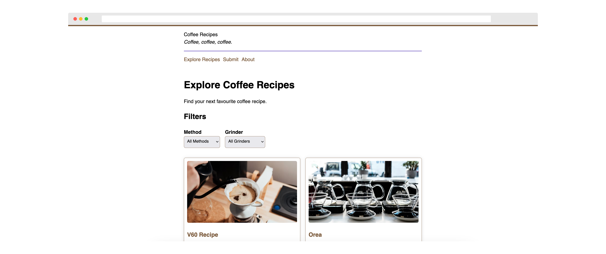

# Coffee Recipes

[coffeerecipes.co](https://coffeerecipes.co) is a website to curate coffee recipes.

Coffee Recipes is designed with text-first recipes in mind, so as to allow easy reference of recipes.

Coffee Recipes works as a progressive web application and is designed to work offline, ensuring you can easily use your app on your phone no matter where you are.

## Contributing

To publish a recipe on Coffee Recipes, read the [Coffee Recipes submission guide](https://coffeerecipes.co/submit).

If you have an idea on how to improve Coffee Recipes, please [open an issue](https://github.com/capjamesg/coffeerecipes.co/issues/new).

## License

The source code in this project, excluding all content in the `recipes/` folder, is licensed under an MIT license.

All content in the `recipes/` folder is licensed under a [Creative Commons Attribution-NonCommercial-ShareAlike 4.0 International License](https://creativecommons.org/licenses/by-nc-sa/4.0/).